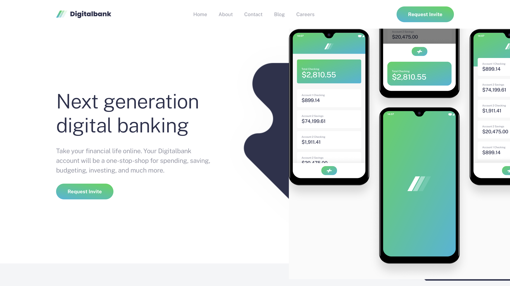

# Digitalbank Landing Page

Digitalbank is a responsive landing page for a modern online banking service. It presents the product's key benefits, articles, and calls to action across desktop, tablet, and mobile layouts, and is built with Vite, React, TypeScript, and Tailwind CSS.

## Table of contents

- [Overview](#overview)
  - [The challenge](#the-challenge)
  - [Screenshot](#screenshot)
  - [Links](#links)
- [My process](#my-process)
  - [Built with](#built-with)
  - [Features](#features)
  - [Run locally](#run-locally)
  - [Build](#build)
  - [Project structure](#project-structure)
  - [What I learned](#what-i-learned)
  - [Continued development](#continued-development)
  - [Useful resources](#useful-resources)
  - [AI Collaboration](#ai-collaboration)
- [Author](#author)
- [Acknowledgments](#acknowledgments)

## Overview

### The challenge

Users should be able to:

- View the optimal layout for the site depending on their device's screen size
- See hover states for all interactive elements on the page

### Screenshot



### Links

- Solution URL: [Click Me](https://www.frontendmentor.io/solutions/digitalbank-landing-X60Tsx3-Up)
- Live Site URL: [Check Me Out](https://digitalbank.wizzoviz.dev)

## My process

### Built with

- [Vite](https://vite.dev) - Frontend build tool
- [Tailwind](https://tailwindcss.com) - For styles
- [React](https://reactjs.org/) - React framework
- [TypeScript](https://typescript.org/) - TypeScript framework

## Features

- Responsive layout: mobile (~375px), tablet (~768px), desktop (1280px+)
- Interactive hamburger menu on tablet and mobile (open/close, Escape, overlay click)
- Hover/active states matching the Desktop Active frame (nav underline, faded CTA)
- Semantic HTML and keyboard-accessible navigation

## Run locally

```bash
npm install
npm run dev
```

The app serves at [http://127.0.0.1:43125](http://127.0.0.1:43125).

## Build

```bash
npm run build
npm run preview
```

## Project structure

- `src/components/LandingPage.tsx` — page assembly
- `src/components/Header.tsx` / `MobileMenu.tsx` — navigation
- `src/components/Hero.tsx`, `Features.tsx`, `Articles.tsx`, `Footer.tsx` — sections
- `src/data/content.ts` — typed feature, article, nav, and social data
- `src/assets/` — logos, icons, hero mockups, and article images exported from Figma


### What I learned

This project helped me practise breaking a marketing page into clear content sections before adding styling. Starting with semantic HTML makes the page easier to understand and gives interactive elements a useful structure to build on.

```html
<section aria-labelledby="why-choose-digitalbank">
  <h2 id="why-choose-digitalbank">Why choose Digitalbank?</h2>
  <p>
    We leverage Open Banking to turn your bank account into your financial hub.
  </p>
</section>
```

I also learned to choose image assets for the viewport they support. The introduction uses separate desktop and mobile background files, while the article images are reusable content assets.

```html
<picture>
  <source media="(max-width: 767px)" srcset="./images/bg-intro-mobile.svg" />
  
</picture>
```

Finally, keeping the color palette and font weights in the style guide helped me make visual decisions from the design instead of guessing at each element independently.

### Continued development

I want to continue improving responsive CSS, especially choosing breakpoints from the content rather than from device names. I also want more practice building the mobile navigation with an accessible menu button, keyboard focus management, and the correct expanded state.

In future projects I will also add automated checks earlier. Useful checks for this page would include testing the layout at widths between the provided designs, checking color contrast, and verifying that every interactive element works with a keyboard.

### Useful resources

- [Frontend Mentor](https://www.frontendmentor.io/) - The challenge gave me a realistic design to reproduce and clear responsive requirements to work toward.
- [MDN: The picture element](https://developer.mozilla.org/en-US/docs/Web/HTML/Reference/Elements/picture) - This helped me understand how to provide different image sources for different viewport conditions.
- [MDN: ARIA button role](https://developer.mozilla.org/en-US/docs/Web/Accessibility/ARIA/Roles/button_role) - This is useful when building a custom mobile navigation control that still needs to communicate its state to assistive technology.
- [Public Sans on Google Fonts](https://fonts.google.com/specimen/Public+Sans) - This is the typeface specified by the design and style guide.

### AI Collaboration

I used GitHub Copilot to help organize this project reflection and turn the implementation details into concise documentation. I kept the design and technical decisions grounded in the challenge files, then reviewed the generated wording for accuracy.

AI was most useful for suggesting documentation structure and pointing out accessibility considerations to verify. I still needed to make the final decisions about the page structure, responsive behavior, and which claims were supported by the project. That review step was important because AI can otherwise describe features that have not actually been implemented.

## Author

- Website - [Joke wizzo](https://www.wizzoviz.tech/)
- Twitter - [Stillwizzo](https://x.com/stillwizzo)
- LinkedIn - [Kuach John](https://www.linkedin.com/in/kuach-john-565ab62aa/)
- Frontend Mentor - [Kuach-joke](https://www.frontendmentor.io/profile/Kuach-joke)

## Acknowledgments

Thanks to [Frontend Mentor](https://www.frontendmentor.io/) for providing the Digitalbank landing page challenge, design files, and optimized assets. The project brief was a useful reference for practising responsive frontend development.
